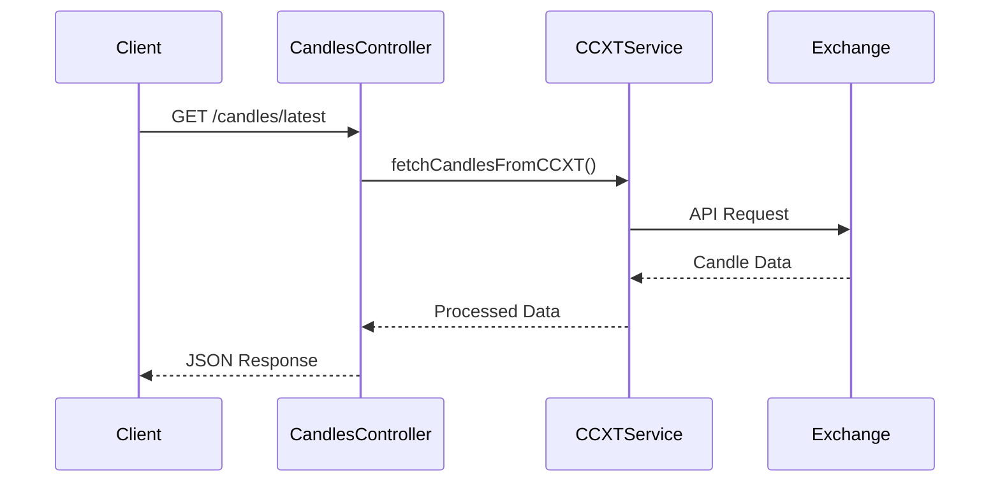
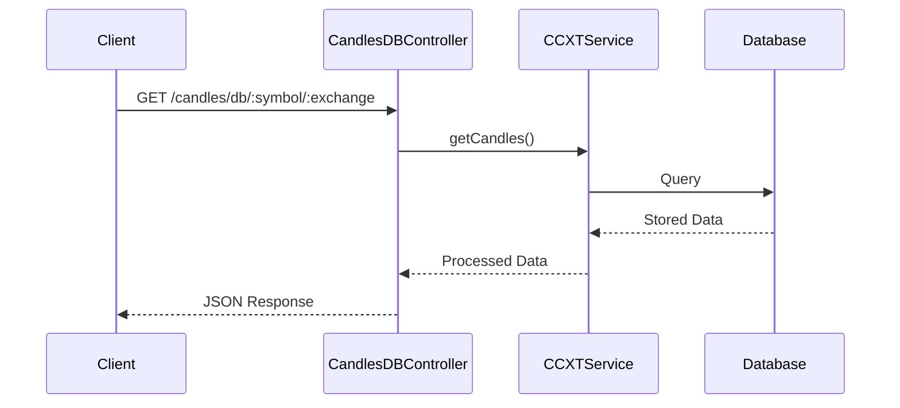

# Technical Documentation

## Project Structure

```
src/
├── candles/
│   ├── controllers/
│   │   ├── candles.controller.ts      # Real-time candles endpoints
│   │   └── candles-db.controller.ts   # Database candles endpoints
│   ├── entities/
│   │   └── candle.entity.ts          # Candle data model
│   └── services/
│       └── candle-fetcher.service.ts # Candle data fetching logic
├── coins/
│   ├── controllers/
│   │   └── coins.controller.ts       # Coins endpoints
│   ├── entities/
│   │   └── coin.entity.ts           # Coin data model
│   └── services/
│       └── coins.service.ts         # Coin management logic
├── exchanges/
│   ├── entities/
│   │   ├── coin-exchange.entity.ts  # Coin-Exchange mapping
│   │   ├── exchange.entity.ts       # Exchange configuration
│   │   └── timeframe.entity.ts      # Timeframe settings
│   └── services/
│       └── ccxt.service.ts         # CCXT integration
├── config/
│   ├── configuration.ts           # App configuration
│   ├── typeorm.config.ts         # Database configuration
│   └── coingecko.config.ts       # CoinGecko API settings
└── tasks/
    ├── tasks.module.ts           # Task scheduling module
    └── tasks.service.ts         # Scheduled tasks
```

## Core Components

### 1. Candle Module

#### CandlesController
- **Purpose**: Handles real-time candle data requests
- **Endpoints**:
  ```typescript
  @Get('latest')
  async getLatestCandles(
    @Query('symbol') symbol: string,
    @Query('exchange') exchange: string,
    @Query('timeframe') timeframe: string = '1h'
  ): Promise<CandleResponse>
  ```
- **Input Validation**:
  - Required: symbol, exchange
  - Optional: timeframe (default: '1h')
  - Timeframe values: ['1h', '4h', '1d']

#### CandlesDBController
- **Purpose**: Manages historical candle data
- **Endpoints**:
  ```typescript
  @Get(':symbol/:exchange')
  async getCandles(
    @Param('symbol') symbol: string,
    @Param('exchange') exchange: string,
    @Query() query: CandleQueryParams
  ): Promise<PaginatedCandleResponse>
  ```
- **Query Parameters**:
  ```typescript
  interface CandleQueryParams {
    timeframe?: string;
    startTime?: number;
    endTime?: number;
    limit?: number;
    page?: number;
  }
  ```

### 2. Exchange Integration

#### CCXTService
- **Purpose**: Manages exchange connections and data fetching
- **Key Methods**:
  ```typescript
  async fetchCandles(
    coin: string,
    exchange: string
  ): Promise<void>

  async getCandles(
    symbol: string,
    exchange: string,
    timeframe: string,
    options: CandleOptions
  ): Promise<CandleData[]>
  ```
- **Rate Limiting**: Implements automatic delay between requests
- **Error Handling**: Manages exchange-specific errors

### 3. Data Models

#### Candle Entity
```typescript
@Entity()
export class Candle {
  @PrimaryGeneratedColumn('uuid')
  id: string;

  @Column()
  symbol: string;

  @Column()
  exchange: string;

  @Column('bigint')
  timestamp: number;

  @Column('decimal')
  open: number;

  @Column('decimal')
  high: number;

  @Column('decimal')
  low: number;

  @Column('decimal')
  close: number;

  @Column('decimal')
  volume: number;

  @CreateDateColumn()
  createdAt: Date;

  @UpdateDateColumn()
  updatedAt: Date;
}
```

#### Coin Entity
```typescript
@Entity()
export class Coin {
  @PrimaryGeneratedColumn('uuid')
  id: string;

  @Column({ unique: true })
  symbol: string;

  @Column()
  name: string;

  @OneToMany(() => CoinExchange, coinExchange => coinExchange.coin)
  exchanges: CoinExchange[];
}
```

### 4. Task Scheduling

#### TasksService
- **Purpose**: Manages automated data collection
- **Scheduled Tasks**:
  ```typescript
  @Cron('0 * * * *')  // Every hour
  async updateCandles()

  @Cron('0 0 * * *')  // Daily
  async updateCoins()
  ```

## Data Flow

### 1. Real-time Candle Data


### 2. Historical Data Flow


## Validation Configuration

### Global Validation Pipe
```typescript
app.useGlobalPipes(new ValidationPipe({
  whitelist: true,
  transform: true,
  forbidNonWhitelisted: true,
  disableErrorMessages: false,
  validateCustomDecorators: true,
  stopAtFirstError: true,
  transformOptions: {
    enableImplicitConversion: true,
  },
}));
```

Key features:
- Automatic input validation using decorators
- Request payload transformation
- Strict validation with non-whitelisted property rejection
- Detailed error messages for debugging
- Custom decorator validation support
- Early validation termination on first error
- Implicit type conversion

### Exchange Validation
```typescript
export class AddExchangeDto {
  @IsString({ message: 'Name must be a string' })
  @IsNotEmpty({ message: 'Name is required' })
  @MinLength(1, { message: 'Name cannot be empty' })
  @Matches(/^[a-zA-Z0-9_-]+$/, { 
    message: 'Name can only contain letters, numbers, underscores and hyphens' 
  })
  @Transform(({ value }) => value?.trim().toLowerCase())
  name: string;
}
```

Features:
- String type validation
- Non-empty value enforcement
- Minimum length requirement
- Pattern matching for allowed characters
- Automatic trimming and lowercase conversion

## Error Handling

### HTTP Status Codes
- 200: Success
- 400: Bad Request (validation errors, invalid parameters)
- 404: Not Found
- 409: Conflict (duplicate entries)
- 500: Internal Server Error
- 502: Bad Gateway (exchange connection issues)

### Validation Exceptions
```typescript
// Built-in validation exceptions
throw new BadRequestException('Exchange name is required');
throw new ConflictException('Exchange with name ${name} already exists');

// Custom validation messages
@IsString({ message: 'Name must be a string' })
@Matches(/^[a-zA-Z0-9_-]+$/, {
  message: 'Name can only contain letters, numbers, underscores and hyphens'
})
```

### Exception Types
```typescript
export class ExchangeException extends HttpException {
  constructor(message: string) {
    super(message, HttpStatus.BAD_GATEWAY);
  }
}

export class ValidationException extends HttpException {
  constructor(message: string) {
    super(message, HttpStatus.BAD_REQUEST);
  }
}
```

## Configuration

### Exchange Configuration
```typescript
interface ExchangeConfig {
  name: string;
  timeframe: string;
  status: number;
}

const exchanges: ExchangeConfig[] = [
  { name: 'binance', timeframe: '1h', status: 2 },
  { name: 'binance', timeframe: '4h', status: 1 },
  { name: 'binance', timeframe: '1d', status: 1 }
];
```

### Database Configuration
```typescript
const typeOrmConfig: TypeOrmModuleOptions = {
  type: 'postgres',
  host: process.env.DB_HOST,
  port: parseInt(process.env.DB_PORT, 10),
  username: process.env.DB_USERNAME,
  password: process.env.DB_PASSWORD,
  database: process.env.DB_NAME,
  entities: [Coin, Exchange, CoinExchange, Candle, TimeFrame],
  synchronize: false,
  logging: process.env.NODE_ENV !== 'production'
};
```

## Testing

### E2E Test Structure
```typescript
describe('CandlesController (e2e)', () => {
  let app: INestApplication;
  
  beforeEach(async () => {
    const moduleFixture = await Test.createTestingModule({
      imports: [AppModule],
    }).compile();
    
    app = moduleFixture.createNestApplication();
    await app.init();
  });

  it('/candles/latest (GET)', () => {
    return request(app.getHttpServer())
      .get('/candles/latest')
      .query({ symbol: 'BTC', exchange: 'binance' })
      .expect(200);
  });
});
```

## Performance Considerations

1. **Database Indexing**
```typescript
@Entity()
@Index(['symbol', 'exchange', 'timestamp'])
export class Candle {
  // ... entity properties
}
```

2. **Query Optimization**
- Pagination implementation
- Time range filtering
- Proper index usage

3. **Rate Limiting**
- Automatic delays between requests
- Configurable request intervals
- Exchange-specific rate limits

4. **Caching Strategy**
- In-memory caching for frequent requests
- Cache invalidation on updates
- Configurable cache duration 