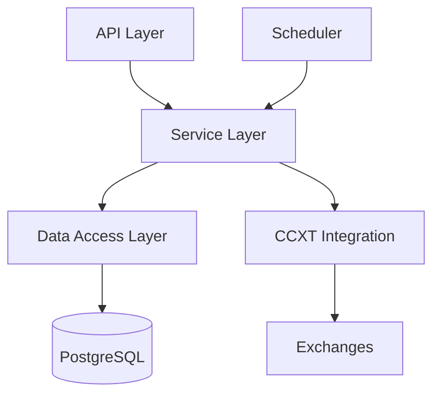
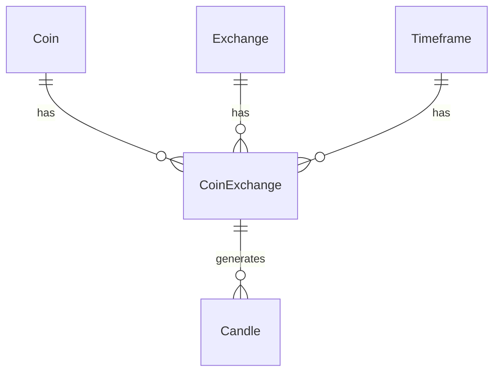

# Technical Documentation

## Architecture Overview

### System Components



### Core Components

1. **API Layer**
   - NestJS Controllers
   - Request/Response DTOs
   - Input Validation
   - Error Handling
   - Rate Limiting

2. **Service Layer**
   - Business Logic
   - Data Processing
   - Exchange Integration
   - Caching Strategy
   - Error Recovery

3. **Data Access Layer**
   - TypeORM Repositories
   - Database Migrations
   - Entity Relationships
   - Query Optimization

## Database Schema

### Entity Relationships



### Entities

1. **Coin**
   ```typescript
   {
     id: uuid
     name: string
     symbol: string
     createdAt: timestamp
     updatedAt: timestamp
   }
   ```

2. **Exchange**
   ```typescript
   {
     id: uuid
     name: string
     isActive: boolean
     createdAt: timestamp
     updatedAt: timestamp
   }
   ```

3. **Timeframe**
   ```typescript
   {
     id: uuid
     interval: string
     minutes: number
     createdAt: timestamp
     updatedAt: timestamp
   }
   ```

4. **CoinExchange**
   ```typescript
   {
     id: uuid
     coin_id: uuid
     exchange_id: uuid
     timeframe_id: uuid
     isActive: boolean
     status: number
     createdAt: timestamp
     updatedAt: timestamp
   }
   ```

5. **Candle**
   ```typescript
   {
     id: uuid
     coin_exchange_id: uuid
     interval: string
     open: decimal(20,8)
     high: decimal(20,8)
     low: decimal(20,8)
     close: decimal(20,8)
     volume: decimal(30,8)
     timestamp: timestamp
   }
   ```

## Data Flow

### Candle Data Collection

1. **Initial Data Collection**
   ```mermaid
   sequenceDiagram
       Scheduler->>CandlesService: Trigger collection
       CandlesService->>CCXTService: Request candles
       CCXTService->>Exchange: Fetch OHLCV
       Exchange-->>CCXTService: Return data
       CCXTService-->>CandlesService: Process data
       CandlesService->>Database: Save/Update
   ```

2. **Update Process**
   - Forward Update: Fetches newer candles
   - Backward Update: Fills historical gaps
   - Status-based Processing:
     - Status 1: Full historical sync
     - Status 2: Recent data only

### Rate Limiting

1. **Exchange-specific Limits**
   ```typescript
   {
     binance: { requests: 1200, period: '1m' },
     kucoin: { requests: 180, period: '1m' },
     okx: { requests: 20, period: '1s' }
   }
   ```

2. **Implementation**
   - Dynamic delay calculation
   - Request queuing
   - Error backoff strategy

## Configuration

### Environment Variables

```env
# Database
DB_HOST=localhost
DB_PORT=5432
DB_USERNAME=postgres
DB_PASSWORD=postgres
DB_NAME=crypto_trading

# Application
PORT=3000
NODE_ENV=development
API_PREFIX=api/v1

# Features
INIT_DB=true
ENABLE_SWAGGER=true
```

### Exchange Configuration

```typescript
export const exchanges = [
  {
    name: 'binance',
    timeframes: ['1h', '4h', '1d'],
    status: 1
  },
  {
    name: 'kucoin',
    timeframes: ['1h', '4h'],
    status: 2
  }
];
```

## Error Handling

### Error Types

1. **API Errors**
   ```typescript
   class ApiError extends Error {
     constructor(
       public statusCode: number,
       public message: string,
       public details?: any
     ) {
       super(message);
     }
   }
   ```

2. **Exchange Errors**
   - Rate limit exceeded
   - Invalid symbol
   - Network issues
   - Maintenance mode

### Error Recovery

1. **Retry Strategy**
   ```typescript
   const retryConfig = {
     attempts: 3,
     delay: 1000,
     backoff: 2
   };
   ```

2. **Circuit Breaker**
   - Failure threshold: 5 errors
   - Reset timeout: 60 seconds
   - Half-open state retry: 1 request

## Performance Optimization

### Database Optimization

1. **Indexes**
   ```sql
   CREATE INDEX idx_candles_timestamp ON candles(timestamp);
   CREATE INDEX idx_candles_coin_exchange ON candles(coin_exchange_id);
   CREATE INDEX idx_coin_exchanges_status ON coin_exchanges(status);
   ```

2. **Query Optimization**
   - Pagination implementation
   - Efficient joins
   - Selective column fetching

### Caching Strategy

1. **In-Memory Cache**
   ```typescript
   const cacheConfig = {
     ttl: 60, // seconds
     max: 100 // items
   };
   ```

2. **Cache Invalidation**
   - Time-based expiration
   - Manual invalidation
   - Update-triggered refresh

## Testing

### Test Types

1. **Unit Tests**
   - Service methods
   - Data transformations
   - Business logic

2. **Integration Tests**
   - API endpoints
   - Database operations
   - Exchange integration

3. **E2E Tests**
   - Complete workflows
   - Error scenarios
   - Performance benchmarks

### Test Configuration

```typescript
const testConfig = {
  database: {
    type: 'postgres',
    host: 'localhost',
    port: 5432,
    username: 'test',
    password: 'test',
    database: 'crypto_trading_test'
  },
  exchanges: {
    useTestnet: true,
    mockResponses: true
  }
};
```

## Deployment

### Docker Configuration

1. **Production Dockerfile**
   ```dockerfile
   FROM node:20-alpine
   WORKDIR /usr/src/app
   COPY package*.json ./
   RUN npm ci --only=production
   COPY . .
   RUN npm run build
   CMD ["npm", "run", "start:prod"]
   ```

2. **Docker Compose**
   ```yaml
   version: '3.8'
   services:
     app:
       build: .
       environment:
         NODE_ENV: production
       deploy:
         replicas: 2
     db:
       image: postgres:16-alpine
       volumes:
         - pgdata:/var/lib/postgresql/data
   ```

### Monitoring

1. **Metrics**
   - Request latency
   - Error rates
   - Database performance
   - Exchange response times

2. **Logging**
   - Request/Response logging
   - Error tracking
   - Performance monitoring
   - Exchange interaction logs

## Security

### API Security

1. **Rate Limiting**
   ```typescript
   const rateLimitConfig = {
     windowMs: 15 * 60 * 1000,
     max: 100
   };
   ```

2. **Input Validation**
   - Request body validation
   - Parameter sanitization
   - Type checking

### Data Security

1. **Database**
   - Encrypted connections
   - Prepared statements
   - Access control

2. **Exchange Integration**
   - API key management
   - Request signing
   - IP whitelisting 