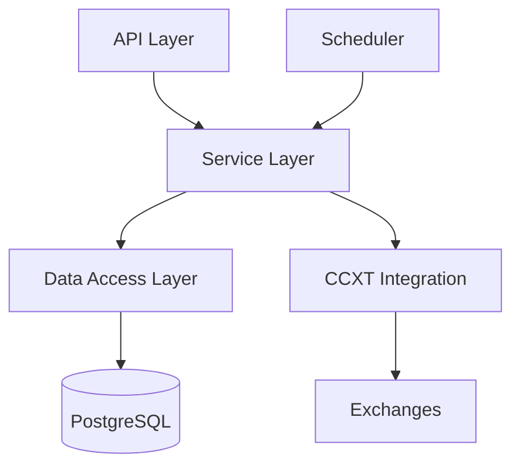

# Technical Documentation

## Architecture Overview

### System Components



### Core Modules

1. **Candles Module**
   - Handles market data operations
   - Manages candle data fetching and storage
   - Implements data synchronization logic

2. **Exchanges Module**
   - Manages exchange configurations
   - Handles CCXT integration
   - Implements rate limiting and error handling

3. **Coins Module**
   - Manages cryptocurrency configurations
   - Integrates with CoinGecko API
   - Handles coin metadata

4. **Timeframes Module**
   - Manages timeframe configurations
   - Handles interval calculations
   - Validates timeframe compatibility

## Database Schema

### Tables

#### 1. coins
```sql
CREATE TABLE coins (
    id UUID PRIMARY KEY,
    name VARCHAR(100) NOT NULL,
    symbol VARCHAR(20) NOT NULL UNIQUE,
    created_at TIMESTAMP DEFAULT CURRENT_TIMESTAMP,
    updated_at TIMESTAMP DEFAULT CURRENT_TIMESTAMP
);
```

#### 2. exchanges
```sql
CREATE TABLE exchanges (
    id UUID PRIMARY KEY,
    name VARCHAR(50) NOT NULL UNIQUE,
    is_active BOOLEAN DEFAULT true,
    created_at TIMESTAMP DEFAULT CURRENT_TIMESTAMP,
    updated_at TIMESTAMP DEFAULT CURRENT_TIMESTAMP
);
```

#### 3. timeframes
```sql
CREATE TABLE timeframes (
    id UUID PRIMARY KEY,
    interval VARCHAR(10) NOT NULL UNIQUE,
    minutes INTEGER NOT NULL,
    created_at TIMESTAMP DEFAULT CURRENT_TIMESTAMP,
    updated_at TIMESTAMP DEFAULT CURRENT_TIMESTAMP
);
```

#### 4. coin_exchanges
```sql
CREATE TABLE coin_exchanges (
    id UUID PRIMARY KEY,
    coin_id UUID REFERENCES coins(id),
    exchange_id UUID REFERENCES exchanges(id),
    timeframe_id UUID REFERENCES timeframes(id),
    is_active BOOLEAN DEFAULT true,
    status INTEGER DEFAULT 1,
    created_at TIMESTAMP DEFAULT CURRENT_TIMESTAMP,
    updated_at TIMESTAMP DEFAULT CURRENT_TIMESTAMP
);
```

#### 5. candles
```sql
CREATE TABLE candles (
    id UUID PRIMARY KEY,
    coin_exchange_id UUID REFERENCES coin_exchanges(id),
    interval VARCHAR(10) NOT NULL,
    open DECIMAL(20,8) NOT NULL,
    high DECIMAL(20,8) NOT NULL,
    low DECIMAL(20,8) NOT NULL,
    close DECIMAL(20,8) NOT NULL,
    volume DECIMAL(30,8) NOT NULL,
    timestamp TIMESTAMP NOT NULL
);
```

## Data Flow

### Candle Data Collection

1. **Initial Data Collection**
   ```typescript
   async fetchInitialCandles(pair: CoinExchange): Promise<void> {
     let hasMore = true;
     let currentTimestamp = Date.now();
     
     while (hasMore) {
       const candles = await fetchBatch(currentTimestamp);
       await saveBatch(candles);
       updateTimestamp();
     }
   }
   ```

2. **Forward Updates**
   ```typescript
   async updateCandlesForward(pair: CoinExchange, fromTimestamp: Date): Promise<void> {
     let hasMore = true;
     
     while (hasMore) {
       const candles = await fetchNewerCandles(fromTimestamp);
       await saveBatch(candles);
       updateTimestamp();
     }
   }
   ```

3. **Backward Updates**
   ```typescript
   async updateCandlesBackward(pair: CoinExchange, fromTimestamp: Date): Promise<void> {
     let hasMore = true;
     
     while (hasMore) {
       const candles = await fetchOlderCandles(fromTimestamp);
       await saveBatch(candles);
       updateTimestamp();
     }
   }
   ```

## Configuration

### Environment Variables

```env
# Database
DB_HOST=postgres
DB_PORT=5432
DB_USERNAME=postgres
DB_PASSWORD=postgres
DB_NAME=crypto_trading

# Application
NODE_ENV=development
PORT=3000
API_PREFIX=api/v1

# CCXT
CCXT_RATE_LIMIT=1000
CCXT_TIMEOUT=30000
```

### Exchange Configuration

```typescript
interface ExchangeConfig {
  name: string;
  timeframes: {
    interval: string;
    status: number;
  }[];
  rateLimit?: number;
  timeout?: number;
}
```

## Error Handling

### Custom Exceptions

```typescript
// Example: NoActivePairsException
class NoActivePairsException extends HttpException {
  constructor(exchange: string, timeframe: string, symbols?: string[]) {
    super({
      statusCode: HttpStatus.NOT_FOUND,
      message: `No active pairs found for exchange ${exchange}...`,
      error: 'Not Found',
      details: { exchange, timeframe, symbols }
    }, HttpStatus.NOT_FOUND);
  }
}
```

### Exchange Errors

```typescript
try {
  await exchangeInstance.fetchOHLCV(symbol, timeframe);
} catch (error) {
  if (error instanceof NoActivePairsException) {
    // Handle missing pairs
    return {
      exchange,
      timeframe,
      symbols: symbols || 'all',
      availableSymbols: [],
      total: 0,
      data: []
    };
  } else if (error instanceof ccxt.RateLimitExceeded) {
    // Handle rate limit
    await delay(error.retryAfter);
  }
}
```

### Database Errors

```typescript
try {
  await this.candleRepository.save(candles);
} catch (error) {
  if (error.code === '23505') { // Unique violation
    await this.handleDuplicate(candles);
  } else if (error.code === '23503') { // Foreign key violation
    await this.handleInvalidReference(candles);
  }
}
```

## Performance Optimization

### Database Indexing

```sql
-- Compound index for efficient candle queries
CREATE INDEX idx_candles_lookup 
ON candles (coin_exchange_id, timestamp);

-- Index for status-based queries
CREATE INDEX idx_coin_exchanges_status 
ON coin_exchanges (status) 
WHERE is_active = true;
```

### Batch Processing

```typescript
// Batch size configuration
private readonly BATCH_SIZE = 1000;

// Batch insert implementation
async saveCandleBatch(candles: Candle[]): Promise<void> {
  await this.candleRepository
    .createQueryBuilder()
    .insert()
    .into(Candle)
    .values(candles)
    .orUpdate(
      ['open', 'high', 'low', 'close', 'volume'],
      ['coin_exchange_id', 'timestamp']
    )
    .execute();
}
```

## Testing

### Unit Tests

```typescript
describe('CandlesService', () => {
  it('should fetch and save candles', async () => {
    const candles = await service.fetchCandlesForPair(mockPair);
    expect(candles).toHaveLength(1000);
    expect(candles[0]).toHaveProperty('timestamp');
  });
});
```

### Integration Tests

```typescript
describe('Candles E2E', () => {
  it('should fetch recent candles', async () => {
    const response = await request(app.getHttpServer())
      .post('/api/v1/candles/fetch-recent')
      .expect(200);
    
    expect(response.body).toHaveProperty('message');
    expect(response.body.details.processed).toBeGreaterThan(0);
  });
});
```

## Deployment

### Docker Configuration

```dockerfile
# Development-focused Dockerfile
FROM node:20-alpine
WORKDIR /usr/src/app
COPY package*.json ./
RUN npm install
COPY . .
CMD ["npm", "run", "start:dev"]
```

### Docker Compose Setup

```yaml
services:
  app:
    volumes:
      - .:/usr/src/app              # Mount entire project
      - /usr/src/app/node_modules   # Preserve container node_modules
    environment:
      - NODE_ENV=development
```

### Development Features

1. **Hot Reloading**
   - Uses `npm run start:dev` for automatic reloading
   - No build step required in development
   - Changes reflect immediately

2. **Volume Mounting**
   - Full project mounted in container
   - Node modules isolated for performance
   - No need to rebuild for code changes

3. **Error Handling**
   - Detailed error messages
   - Custom exceptions for common cases
   - Proper HTTP status codes
   - Structured error responses

4. **Response Format**
   ```typescript
   interface CandleResponse {
     exchange: string;
     timeframe: string;
     symbols: string[] | 'all';
     availableSymbols: string[];  // Actually available symbols
     total: number;
     data: Candle[];
   }
   ```

### Production Considerations

1. **Scaling**
   - Horizontal scaling for API servers
   - Database connection pooling
   - Redis caching for frequently accessed data

2. **Monitoring**
   - Prometheus metrics
   - Grafana dashboards
   - Error tracking with Sentry

3. **Security**
   - Rate limiting
   - API key authentication
   - Input validation
   - SQL injection prevention 